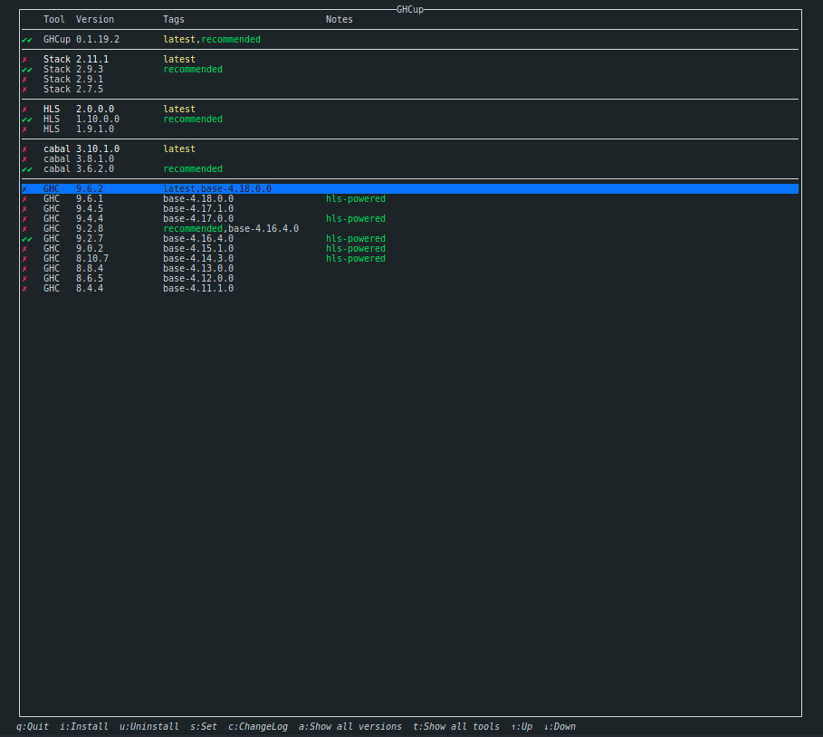

## Introduce

Haskell은 GHC 라고 하는 컴파일러를 이용해서 바이너리파일을 직접 만들 수 있는 컴파일 언어이다. 과거에는 컴파일러인 GHC와 GHCi 라고 하는 대화형 인터프리터, runghc 라는 스크립트 실행기 형태로 사용하는 방법이 소개되었고 cabal 프로젝트 매니저를 이용해서 패키지 형태로 관리할 수 있게 하는 방법들을 소개했었다.
지금은 GHCup 라고 하는 Haskell 생태계를 관리하는 관리자를 이용해서 따로 설치해야 했던 ghc, cabal, stack, langhage haskell server의 설치버전을 관리할 수 있게됐다.



여기에서 초록색 체크 심볼은 설치되어있는 버전, 현재 적용되어있는 버전 이렇게 두가지를 각각 표기하고있다. 예전엔 따로 개발자가 직접 관리해야했다면 지금은 이렇게 통합해서 관리할 수 있는 모듈이 생긴 것으로 이해할 수 있다. 결론은 아무튼 좋아졌다.

앞으로 이 언어에 대해 계속해서 공부했던 내용을 정리해볼 것이다.

## Source Execution

모든 샘플은 build를 기준으로 만들어갈 것이다. 왜냐하면 그래야 여러 파일을 모듈화해서 테스트를 확장시켜갈 수 있기 때문이다. 아마 Haskell을 계속 공부하면서는 이런 모듈화 된 프로젝트를 중심으로 하게 될 것 같다.

Haskell의 컴파일러는 여러 종류(ghc, hugs, lhc, uhc 등)가 있지만, 여기서는 GHCup를 이용해 설치, 관리할 수 있는 ghc를 중심으로 할 것이다. 다른 컴파일러는 나중에 비교하며 다뤄보면 좋겠다.

아래에서는 단일 파일에 대한 컴파일, 그리고 cabal을 이용해 관리되는 프로젝트의 빌드를 살펴보려고 한다.

### Compile

목적은 당연히 바이너리로 된 실행파일을 만들어내는 것이다.

``` haskell
-- main.hs
main = putStrLn "Hello world!!"
```

간단하게 main.hs 라는 파일로 만든다고 가정하고 코드를 작성했다. 이제 이 코드를 컴파일한다.

``` shell
$ ghc main.hs
```

이렇게 하면 총 3가지 파일이 만들어지는데, `main.hi`, `main.o`, `main` 이다. 목적코드(`main.o`)를 만들고, 인터페이스 파일(`main.hi` gcc에서 .c 파일을 컴파일 할때는 만들어지지 않는다)을 만든다. 그 후 링커가 여러 라이브러리와 링킹을 마친 바이너리 파일을 만들고 종료한다. 이렇게 만들어진 실행파일은 다른 언어에서 만든 컴파일 결과물과 동일하게 실행시켜볼 수 있다.

``` shell
$ ./main
Hello World!!
```

이렇게 하면 프로그램이 실행된다.

### Build

cabal을 이용해 패키지를 빌드하는 방법은 좀 더 까다롭다. 순서는 cabal을 이용해서 프로젝트를 초기화 하고 cabal 설정 파일에 현재 프로젝트에서 추가로 컴파일 할 패키지들을 목록으로 작성한다. 그리고 cabal 명령어를 이용해 빌드 작업을 해주면 된다.

이 순서를 한단계씩 실행시키면 이렇게 된다.

#### 1. cabal init

``` shell
$ cabal init
```

이 명령을 실행하고나면 최소한의 프로젝트 디렉토리 구조를 만들어준다.

``` shell
project_dir:
CHANGELOG.md
app
project_dir.cabal 

project_dir/app:
Main.hs
```

#### 2. cabal build

다음은 이 명령인데, 이 명령을 실행하면 `.cabal` 파일에 정의되어있는대로 컴파일을 순서대로 진행한 뒤 바이너리 파일까지 만들도록 되어있다. 이 명령은 기본적으로 현재 디렉토리에 Haskell 코드 빌드 결과물을 남기고 버저닝 하는 작업을 수행한다.

``` shell
$ cabal build
```

이 명령을 실행하면 `dist-newstyle` 디렉토리 아래에 프로젝트를 생성한 디렉토리 이름과 같은(프로젝트 이름이 디렉토리 이름과 같다면) 이름으로 실행파일을 만들고 안에 같이 만든 모듈들을 별도 목적코드로 만들어서 링킹을 하는 작업을 실행한다.

이제부터 이 디렉토리 아래에서 코드를 수정하고 `cabal build` 명령을 실행하면 변경된 코드를 감지해서 해당 목적코드만을 컴파일 하게 된다.

#### 3. cabal run

이 명령은 위에서 만든 실행파일을 실제로 실행시키는 명령인데, cabal은 기본적으로 패키지를 만들고, hackage라고 하는 표준 패키지관리 서버로 생성한 패키지를 업로드하도록 되어있다. 나중에 다루겠지만, 이 패키지는 `Setup.hs` 파일을 갖고있거나, `.cabal`파일을 갖고 있어야 한다. 먄악 `Setup.hs` 파일이 있다면 `runghc Setup configure`로, `.cabal` 파일이 있다면 `cabal install ./{dir name}` 으로 설치할 수 있다.

지금 예제로 만든 프로젝트는 따로 건드리지 않았기 때문에 기본적으로 만들어지는 코드는 다음과 같다. 

``` haskell
-- app/Main.hs
module Main where

main :: IO ()
main = putStrLn "Hello, Haskell!!"
```

낯선 구문이 많지만 실행하면 결국 이렇게 나온다.

``` shell
$ cabal run
Hello, Haskell!!
```

## Conclusion

Haskell을 처음 공부 해보면 어떤 교재에서는 대뜸 Haskell이 갖고있는 독특한 타입시스템과 함수형 언어의 특성, 그리고 문법 구조 등을 설명하고 전부 repl을 이용해서 설명하기 때문에 "그래서 실제로 프로그램을 만들려면 어떻게 해야되나"라는 물음을 갖고있었는데, 그 부분을 해소하고 시작지점을 잡기위해서 컴파일러, 빌더의 사용방법을 대충 정리해봤다.

물론 ghcup를 이용한 ghc 설치, HLS(haskell language server) 등에 대한 설명은 전혀 하지 않았는데, 지금은 별로 필요하지 않다고 생각했고 나중에 필요하다면 추가로 자료를 정리해두려 한다.

우선은 문법을 어떻게 써야 하고, 외부 라이브러리를 어떻게 써야 하고, 어떤 필요성으로 인해 외부 라이브러리를 가져와야 하는지 등을 좀 더 탐구하고 hoogle에서 외부 라이브러리를 가져오는 방법 등을 하나씩 살펴보면서 Haskell 언어를 익혀갈 예정이다.
